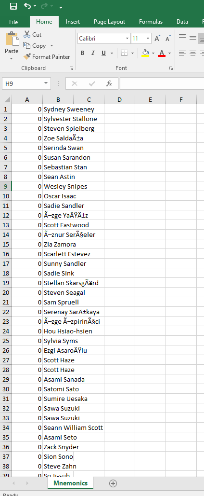
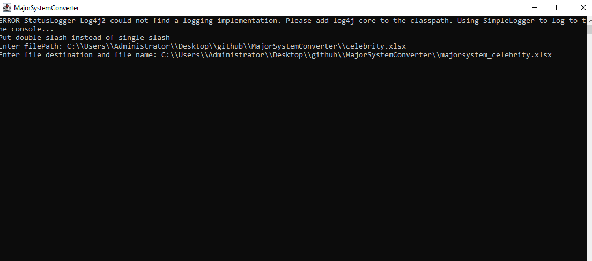

# Major System Name Converter

Convert a list of names (or words) from an Excel file into **Major System mnemonic numbers** — a memory technique that turns sounds into digits, commonly used to memorize numbers, cards, dates, etc.

You give the program an Excel file with names in the first column, and it produces a **new** Excel file where each name is paired with its Major System number.

---

### The Major System reference chart

Only the **sound** matters, not the spelling — e.g. "spaghetti" → s=0, p=9, g=7, t=1 (double "t" counts once) → **0971**.

| Digit | Sounds |
|---|---|
| 0 | s, z, soft c, soft x |
| 1 | t, d |
| 2 | n |
| 3 | m |
| 4 | r |
| 5 | l |
| 6 | j, sh, zh, soft ch, soft g |
| 7 | k, q, qu, hard c, hard ch, hard g, hard x (/gz/) |
| 8 | f, v |
| 9 | p, b |

**Special 3-digit codes** (for irregular pronunciations):

| Sound | Code |
|---|---|
| Soft c | 130 |
| Hard c | 230 |
| Soft g | 170 |
| Hard g | 270 |
| Soft ch | 180 |
| Hard ch | 280 |
| Soft x | 150 |
| Hard x | 250 |
| "ck" (sounds like one k) | 990 |

**Hard vs. soft, quick rules:**

- **C:** soft before *e, i, y*; hard otherwise. "ck" counts as one sound.
- **G:** soft before *e, i, y* — except common exceptions like *girl, get, give*, which stay hard. Silent-g words (*night, design, high*) count as soft.
- **CH:** French-style /sh/ (*chef, brochure*) is soft; Greek/hard-style /k/ (*school, ache, stomach*) is hard; /tch/ or /tsh/ words (*beach, cheese, rich*) count as soft.
- **X:** soft (/gz/) when "ex" is followed by a stressed vowel (*exActly*); otherwise hard (/ks/), as in *six, explain*.


## Download (just want to use it?)

No Java, no IntelliJ, no setup of any kind required.

1. Go to the Releases page of this repo.
2. Download `MajorSystemConverter-1.0.0.exe`.
3. Double-click it. You'll see a brief **"Please wait while Windows configures MajorSystemConverter"** box — that's it installing. There's no wizard with Next/Finish buttons; it installs itself automatically and the box closes on its own when done.
   - Windows may show a **"Windows protected your PC"** warning first, since this installer isn't digitally signed. This is normal for small independent projects — click **More info → Run anyway** to continue.
4. Once it's done, find **MajorSystemConverter** on your Desktop or in your Start Menu, and open it from there. A console/terminal-style window will open — that's normal, that's how the program talks to you.

### Using the program

The program will ask you two questions in that window, one at a time:

```
Put double slash instead of single slash 
Enter filePath:
```

Type the **full path to your input Excel file**, using **double backslashes** (`\\`) instead of single ones, e.g.:

```
D:\\MyFiles\\Names.xlsx
```

Then press Enter.

```
Enter file destination and file name:
```

Type the **full path (including file name)** for where you want the new, processed Excel file saved, e.g.:

```
D:\\MyFiles\\majorsystem_Names.xlsx
```

Then press Enter. When it's done, you'll see:

```
ProcessedMnemonics written successfully...
```

Go to the destination path you typed — your new Excel file will be there.

### Preparing your Excel file

1. **File format** must be `.xlsx`.
2. **Names go in the very first column** (column A), starting from the first row (`A1`) and continuing downward.
3. You can include a **birth date in parentheses** right after a name, and it will be stripped out automatically — e.g. `Maria Santos (1985)` → `Maria Santos`.
4. **Dashes and extra spaces** in names are fine — they're cleaned up automatically.
5. Only the **first and last name** are used. If a name has a middle name or more, everything after the last name is ignored.
6. A **single-word entry** (e.g. a verb or noun) still produces two numbers from that one word.

### Understanding the output

The output Excel file has two columns per row:

| Column A | Column B |
|---|---|
| Major System number | Original name |

### Example

Here's a real run of the program, converting a list of celebrity names.

**Input — `celebrity.xlsx`** (names only, in column A):


**Output — `majorsystem_celebrity.xlsx`** (number in column A, name in column B):



**The program run itself**, showing the two prompts answered:



```
Put double slash instead of single slash 
Enter filePath: C:\\Users\\Administrator\\Desktop\\github\\MajorSystemConverter\\celebrity.xlsx
Enter file destination and file name: C:\\Users\\Administrator\\Desktop\\github\\MajorSystemConverter\\majorsystem_celebrity.xlsx
```

*(You may also see a line like `ERROR StatusLogger Log4j2 could not find a logging implementation...` print above the prompts — that's a harmless notice from one of the bundled libraries, not an error in your program. It doesn't affect the conversion at all and can be ignored.)*

A few rows from that run, for reference:

| Name | Major System Number |
|---|---|
| Sydney Sweeney | 0 |
| Scarlett Johansson | 6 |
| Morgan Freeman | 38 |
| Ryan Reynolds | 44 |
| Alan Ritchson | 54 |
| Jason Statham | 60 |

### Troubleshooting

| Problem | Likely Cause |
|---|---|
| Program can't find your file | Check the path is correct and uses `\\` instead of `\` |
| A name is skipped with a console warning | The cell in Excel isn't formatted as text |
| Output has wrong or missing numbers | Double-check the name only has letters, spaces, dashes, or a birth date in parentheses |
| A red `ERROR StatusLogger Log4j2 could not find a logging implementation...` line appears when the program starts | Harmless — a bundled library checking for an optional logging setup that isn't present. It doesn't affect the conversion; safe to ignore. |

---

## Building from Source (for developers)

This repo contains the original `.java` source files plus a `pom.xml` — Maven's project file, which lists the two dependencies this project needs (Apache POI, Commons Collections4) and the packaging config that bundles everything into one runnable jar. It's not application code, but it's required for the steps below to work.

Assuming a completely clean Windows machine — no JDK, no IntelliJ — here's exactly how to get from source code to a working installer.

### 1. Install a JDK

This project was built and tested with **JDK 26**.

1. Go to [adoptium.net](https://adoptium.net/) and download the **JDK 26 (LTS or latest)** Windows x64 installer (`.msi`).
2. Run it. On the "Custom Setup" screen, make sure these are checked (they're on by default):
   - **Set or override JAVA_HOME variable**
   - **Add to PATH**
3. Finish the install.
4. Verify it worked: open **PowerShell** and run:
   ```
   java --version
   ```
   You should see a version number printed (e.g. `java 26.0.2 ...`). If you instead see "not recognized," the PATH step above didn't take — reinstall and make sure that checkbox is checked, or restart your PC (PATH changes need a fresh terminal, sometimes a fresh login).

### 2. Install IntelliJ IDEA

1. Go to [jetbrains.com/idea/download](https://www.jetbrains.com/idea/download/) and download the **Community Edition** (free — no license needed; it fully supports everything this project uses).
2. Run the installer with default options.

### 3. Get the source code

Download or clone this repo to a folder on your machine, e.g. `Downloads\major-system-converter`. Make sure `pom.xml` and all the `.java` files end up in the same place they're in this repo (`.java` files inside `src\main\java`, `pom.xml` at the root).

### 4. Open the project in IntelliJ

1. **File → Open**, and select the `major-system-converter` folder (the one containing `pom.xml`).
2. IntelliJ recognizes it as a Maven project automatically and imports it in the background — you likely won't see any popup to click. Give it a minute; watch the small progress bar at the very bottom of the window.
3. Confirm it worked: a vertical **Maven** tab should appear on the right edge of the window. Click it, expand your project — you should see **Lifecycle**, **Plugins**, and **Dependencies** nodes. If **Dependencies**/**Plugins** are missing, click the **Reload All Maven Projects** icon (circular arrows) at the top of that panel and wait for it to finish downloading.
4. Set the Project SDK: **File → Project Structure → Project**, and make sure **SDK** points to the JDK you just installed. If it's not listed, click **Add SDK → Download JDK** (or point it at your existing install folder, typically under `C:\Program Files\Eclipse Adoptium\`).

### 5. (Optional) Test-run it inside IntelliJ

Open `src/main/java/Main.java`, click the green ▶ arrow next to `public static void main`. The **Run** panel at the bottom acts as your console for typing file paths.

### 6. Build the jar

You will **not** be able to run `mvn` directly in a plain PowerShell/Command Prompt window — IntelliJ bundles its own private copy of Maven that isn't added to your system PATH. That's expected, not a bug. Instead, build through IntelliJ itself:

1. Open the **Maven** tool window (right edge tab).
2. Expand **Lifecycle**.
3. Double-click **package**.
4. Wait for `BUILD SUCCESS` in the output at the bottom.
5. Confirm a `target` folder now exists in your project, containing `MajorSystemConverter.jar`.

### 7. Install WiX Toolset 3.14.1

This is required for the next step, which packages the jar into a Windows installer.

1. Go to [github.com/wixtoolset/wix3/releases/tag/wix3141rtm](https://github.com/wixtoolset/wix3/releases/tag/wix3141rtm) and download `wix314.exe`.

   *(Use this exact version, not the newest WiX release. WiX 6+ introduced a paid "maintenance fee" model for commercial/revenue use; 3.14.1 predates that and is fully free under the original MS-RL license. It's also the version jpackage is built to work with most reliably.)*
2. Run the installer, accepting the defaults.

### 8. Package the installer

1. Open a terminal in your project folder — either IntelliJ's built-in **Terminal** tab (`Alt+F12`) or a regular PowerShell window navigated to the project folder.
2. If you opened a plain PowerShell window (not IntelliJ's terminal), and it refuses to run a script you place there with an error like *"not recognized... but does exist in the current location,"* prefix it with `.\` — this is a PowerShell security default, not a problem with the file.
3. Run:
   ```
   mkdir dist
   jpackage --type exe --input target --dest dist --name MajorSystemConverter --main-jar MajorSystemConverter.jar --main-class Main --app-version 1.0.0 --win-console --win-shortcut --win-menu --vendor "Major System Converter"
   ```
4. When it finishes, your installer will be at:
   ```
   dist\MajorSystemConverter-1.0.0.exe
   ```

That file is fully self-contained — it bundles your compiled code, the POI/Commons Collections4 libraries, and a private copy of the Java runtime. It will install and run on any Windows machine, with no Java, IntelliJ, or WiX required on that end.

### Common build errors

| Error | Fix |
|---|---|
| `'mvn' is not recognized...` | Expected — build via IntelliJ's Maven panel (Step 6) instead of typing `mvn` directly. |
| `... not recognized as the name of a cmdlet ... does exist in the current location` when running a script | Prefix it with `.\`, e.g. `.\build-windows.bat` |
| `Non-parseable POM ... in comment after two dashes (--)` | An XML comment somewhere in `pom.xml` contains a literal `--`, which XML forbids inside comments. Find and remove it. |
| `jpackage` fails looking for `candle.exe`/`light.exe` | WiX isn't installed, or the wrong version is. Install WiX **3.14.1** specifically (Step 7) — WiX 4/5/6 use a different toolchain that jpackage doesn't reliably support yet. |
| Windows shows "Windows protected your PC" when running the built `.exe` | Normal for an unsigned installer — click **More info → Run anyway**. |
